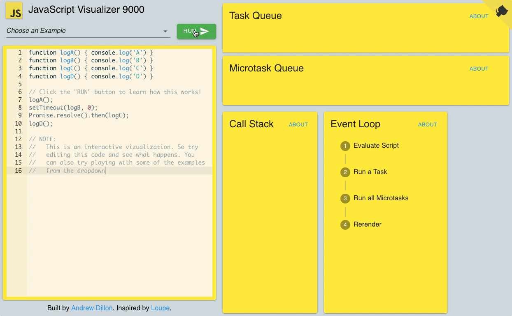

# JavaScript运行机制

## 一、运行机制

JavaScript是单线程的编程语言，事件循环（Event Loop）是javascript的执行机制。

 * JavaScript 有一个基于事件循环的并发模型，事件循环负责执行代码、收集和处理事件以及执行队列中的子任务。这个模型与其他语言中的模型截然不同，比如 C 和 Java。

既然js是单线程，那就像只有一个窗口的银行，客户需要排队一个一个办理业务，同理js任务也要一个一个顺序执行。如果一个任务耗时过长，那么后一个任务也必须等着。那么问题来了，假如我们浏览网页，但是网页包含的高清图片加载很慢，难道我们的网页要一直卡着直到图片完全显示出来？因此将任务分为两类：

## 二、事件循环（Event Loop）

### 同步任务（阻塞）
### 异步任务（非阻塞）
  * 计时器（setTimeout和setInterval）
  * Ajax 异步请求
  * 读取文件

当我们打开网站时，网页的渲染过程就是一大堆同步任务，比如页面骨架和页面元素的渲染。而像加载图片音乐之类占用资源大耗时久的任务，就是异步任务。
先执行同步任务，再执行异步任务，所有异步任务都要等待同步任务执行完成后执行

### 执行流程




同步和异步任务分别进入不同的执行"场所"，同步的进入主线程，异步的进入Event Table并注册函数。
当指定的事情完成时，Event Table会将这个函数移入Event Queue。
主线程内的任务执行完毕为空，会去Event Queue读取对应的函数，进入主线程执行。
上述过程会不断重复，也就是常说的Event Loop(事件循环)。

我们不禁要问了，那怎么知道主线程执行栈为空啊？js引擎存在monitoring process进程，会持续不断的检查主线程执行栈是否为空，一旦为空，就会去Event Queue那里检查是否有等待被调用的函数。


## 三、setTimeout和setInterval延迟问题

#### setTimeout

setTimeout延时执行，经常用于需要延时几秒执行代码，但有时候设定延时两秒，可能会三秒、四秒才执行。

```js
setTimeout(()=> { 
  test();
}, 2000) 
```

setTimeout这个函数，是经过指定时间后，把要执行的任务（如 test() 函数）加入到Event Queue(事件队列)中，又因为是单线程任务要一个一个执行，如果前面的任务需要的时间太久，那么只能等着，导致真正的延迟时间远远大于预设时间。

```js
setTimeout(()=> { 
  test();
}, 0) 
```

如果设置0秒后执行，也不会立即执行，设定0秒后指定某个任务在主线程最早可得的空闲时间执行，意思就是不用再等多少秒了，只要主线程执行栈内的同步任务全部执行完成，栈为空就马上执行。

#### setInterval

setInterval是循环执行。对于执行顺序来说，setInterval会每隔指定的时间将注册的函数置入Event Queue，如果前面的任务耗时太久，那么同样需要等待。

## 四、Promise与process.nextTick(callback)

而process.nextTick(callback)类似node.js版的"setTimeout"，在事件循环的下一次循环中调用 callback 回调函数。
* 注：process.nextTick 需要在node环境下运行

除了广义的同步任务和异步任务，我们对任务有更精细的定义：

macro-task(宏任务)：包括整体代码script，setTimeout，setInterval
micro-task(微任务)：Promise，process.nextTick

不同类型的任务会进入对应的Event Queue，比如setTimeout和setInterval会进入相同的Event Queue。
事件循环的顺序，决定js代码的执行顺序。进入整体代码(宏任务)后，开始第一次循环。接着执行所有的微任务。然后再次从宏任务开始，找到其中一个任务队列执行完毕，再执行所有的微任务。

```js
setTimeout(function() {
    console.log('setTimeout');
})

new Promise(function(resolve) {
    console.log('promise');
}).then(function() {
    console.log('then');
})

console.log('console');

```

* 这段代码作为宏任务，进入主线程。
* 先遇到setTimeout，那么将其回调函数注册后分发到宏任务Event Queue。(注册过程与上同，下文不再描述)
* 接下来遇到了Promise，new Promise立即执行，then函数分发到微任务Event Queue。
* 遇到console.log()，立即执行。
* 好啦，整体代码script作为第一个宏任务执行结束，看看有哪些微任务？我们发现了then在微任务Event Queue里面，执行。
* ok，第一轮事件循环结束了，我们开始第二轮循环，当然要从宏任务Event Queue开始。我们发现了宏任务Event Queue中setTimeout对应的回调函数，立即执行。
* 结束。


## 五、宏任务和微任务

### 宏任务

宏任务是JavaScript中最原始的异步任务，包括setTimeout、setlnterval、AJAX等，在代码执行环境中按照同步代码的顶序，逐个进入作线程挂起，再按照异步任务到达的时间节点，逐个进入异步任务队列，最终按照队列中的顺序进入函数执行栈进行执行。

### 微任务

微任务是随着ECMA标准升级提出的新的异步任务，微任务在异步任务队列的基础上增加了[微任务] 的概念，每个宏任务执行前，程会先检测代码中是否有当次 事件循环Q未执行的微任务，优先清空本次的微任务后，再执行下一个宏任务，每一个宏任务内部可注册当次任务的微任务队列，再下一个宏任务执行前运行，微任务也是按照进入队列的顺序执行的。

## 六、总结

* JavaScript是一门单线程语言，不管是什么新框架新语法糖实现的所谓异步，其实都是用同步的方法去模拟的，事件循环是js实现异步的一种方法，也是js的执行机制。

* 执行和运行有很大的区别，JavaScript在不同的环境下，比如node，浏览器，Ringo等等，执行方式是不同的。而运行大多指javascript解析引擎，是统一的。

* 微任务和宏任务还有很多种类，比如setImmediate等等，执行都是有共同点的，有兴趣的同学可以自行了解。

* JavaScript是一门单线程语言
* Event Loop是javascript的执行机制
