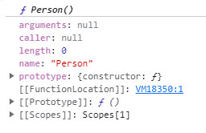
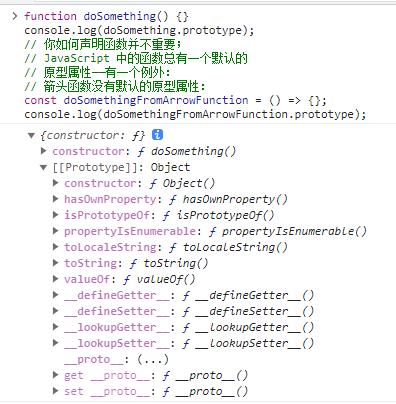

> 

# JavaScript继承与原型链

## 一、MDN 对继承与原型链的定义

对于使用过基于类的语言（如 Java 或 C++）的开发者来说，JavaScript 实在是有些令人困惑——JavaScript 是动态的且没有静态类型。

当谈到继承时，JavaScript 只有一种结构：对象。每个对象（object）都有一个私有属性指向另一个名为原型（prototype）的对象。原型对象也有一个自己的原型，层层向上直到一个对象的原型为 null。根据定义，null 没有原型，并作为这个原型链（prototype chain）中的最后一个环节。可以改变原型链中的任何成员，甚至可以在运行时换出原型，因此 JavaScript 中不存在静态分派的概念。

尽管这种混杂通常被认为是 JavaScript 的弱点之一，但是原型继承模型本身实际上比类式模型更强大。例如，在原型模型的基础上构建类式模型（即类的实现方式）相当简单。

尽管类现在被广泛采用并成为 JavaScript 中新的范式，但类并没有带来新的继承模式。虽然类为大部分原型的机制提供了抽象，但了解原型在底层是如何工作的仍然十分有用。

## 二、原型与原型链

### prototype
每个函数都有一个 `prototype` 属性，就是我们经常在各种例子中看到的那个 prototype ，比如：

```js
function Person() {

}
// 虽然写在注释里，但是你要注意：
// prototype是函数才会有的属性
Person.prototype.name = 'Kevin';
var person1 = new Person();
var person2 = new Person();
console.log(person1.name) // Kevin
console.log(person2.name) // Kevin
```


函数的 prototype 属性指向了一个对象，这个对象正是调用该构造函数而创建的实例的原型，也就是这个例子中的 person1 和 person2 的原型。

那什么是原型呢？你可以这样理解：每一个JavaScript对象(null除外)在创建的时候就会与之关联另一个对象，这个对象就是我们所说的原型，每一个对象都会从原型"继承"属性。

让我们用一张图表示构造函数和实例原型之间的关系：


### `__proto__`

这是每一个JavaScript对象(除了 null )都具有的一个属性，叫`__proto__`，这个属性会指向该对象的原型。

为了证明这一点,我们可以在火狐或者谷歌中输入：

```js
function Person() {

}
var person = new Person();
console.log(person.__proto__ === Person.prototype); // true
```
于是我们更新下关系图：


注：`__proto__` 是绝大部分浏览器都支持这个非标准的方法访问原型，然而它并不存在于 Person.prototype 中，实际上，它是来自于 Object.prototype ，与其说是一个属性，不如说是一个 getter/setter，当使用 `obj.__proto__` 时，可以理解成返回了 Object.getPrototypeOf(obj)。

### constructor

每个原型都有一个 constructor 属性指向关联的构造函数。

为了验证这一点，我们可以尝试：

```js
function Person() {

}
console.log(Person === Person.prototype.constructor); // true
```
所以再更新下关系图：


综上我们已经得出：
```js
function Person() {

}

var person = new Person();

console.log(person.__proto__ == Person.prototype) // true
console.log(Person.prototype.constructor == Person) // true
// 顺便学习一个ES5的方法,可以获得对象的原型
console.log(Object.getPrototypeOf(person) === Person.prototype) // true
```
了解了构造函数、实例原型、和实例之间的关系，接下来我们讲讲实例和原型的关系：

当读取实例的属性时，如果找不到，就会查找与对象关联的原型中的属性，如果还查不到，就去找原型的原型，一直找到最顶层为止。

举个例子：
```js
function Person() {

}

Person.prototype.name = 'Kevin';

var person = new Person();

person.name = 'Daisy';
console.log(person.name) // Daisy

delete person.name;
console.log(person.name) // Kevin
```
在这个例子中，我们给实例对象 person 添加了 name 属性，当我们打印 person.name 的时候，结果自然为 Daisy。

但是当我们删除了 person 的 name 属性时，读取 person.name，从 person 对象中找不到 name 属性就会从 person 的原型也就是 `person.__proto__` ，也就是 Person.prototype中查找，幸运的是我们找到了 name 属性，结果为 Kevin。

在前面，我们已经讲了原型也是一个对象，既然是对象，我们就可以用最原始的方式创建它，那就是：

var obj = new Object();
obj.name = 'Kevin'
console.log(obj.name) // Kevin
其实原型对象就是通过 Object 构造函数生成的，结合之前所讲，实例的 `__proto__` 指向构造函数的 prototype ，所以我们再更新下关系图：


### 原型链总结

那 Object.prototype 的原型呢？

null，我们可以打印：

`console.log(Object.prototype.__proto__ === null)` // true
然而 null 究竟代表了什么呢？

引用阮一峰老师的 《undefined与null的区别》 就是：

null 表示“没有对象”，即该处不应该有值。

所以 `Object.prototype.__proto__` 的值为 null 跟 Object.prototype 没有原型，其实表达了一个意思。

所以查找属性的时候查到 Object.prototype 就可以停止查找了。

最后一张关系图也可以更新为：


## 三、基于原型链的继承

### 继承属性
JavaScript 对象是动态的属性（指其自有属性）“包”。JavaScript 对象有一个指向一个原型对象的链。当试图访问一个对象的属性时，它不仅仅在该对象上搜寻，还会搜寻该对象的原型，以及原型的原型，依次层层向上搜索，直到找到一个名字匹配的属性或到达原型链的末尾。

前面我们讲到“每一个对象都会从原型‘继承’属性”，实际上，继承是一个十分具有迷惑性的说法，引用《你不知道的JavaScript》中的话，就是：
继承意味着复制操作，然而 JavaScript 默认并不会复制对象的属性，相反，JavaScript 只是在两个对象之间创建一个关联，这样，一个对象就可以通过委托访问另一个对象的属性和函数，所以与其叫继承，委托的说法反而更准确些。

### 继承属性
原型的好处在于一些重复的方法可以重用。

存在大量方法引用相同的函数时，可以降低了内存使用率。
但是，手动绑定每个对象创建的 __proto__ 仍旧非常不方便。这时，我们就可以使用构造函数，它会自动为每个构造的对象设置 [[Prototype]]。构造函数是使用 `new` 调用的函数。

构造函数可以重写为类，类是构造函数的语法糖。

#### 构建更长的继承链
要构建更长的原型链，我们可用通过 `Object.setPrototypeOf()` 函数设置 Constructor.prototype 的 [[Prototype]]。

```js
function Base() {}
function Derived() {}
// 将 `Derived.prototype` 的 `[[Prototype]]`
// 设置为 `Base.prototype`
Object.setPrototypeOf(Derived.prototype, Base.prototype);

const obj = new Derived();
// obj ---> Derived.prototype ---> Base.prototype ---> Object.prototype ---> null
```

在类的术语中，这等同于使用 extends 语法。

```js
class Base {}
class Derived extends Base {}

const obj = new Derived();
// obj ---> Derived.prototype ---> Base.prototype ---> Object.prototype ---> null
```
## 四、检查原型：更深入的研究
```js
function doSomething() {}
console.log(doSomething.prototype);
// 你如何声明函数并不重要；
// JavaScript 中的函数总有一个默认的
// 原型属性——有一个例外：
// 箭头函数没有默认的原型属性：
const doSomethingFromArrowFunction = () => {};
console.log(doSomethingFromArrowFunction.prototype);
``` 
如上所示，doSomething() 有一个默认的 prototype 属性（正如控制台所示）。运行这段代码后，控制台应该显示一个类似于下面的对象。



## 五、性能
原型链上较深层的属性的查找时间可能会对性能产生负面影响，这在性能至关重要的代码中可能会非常明显。此外，尝试访问不存在的属性始终会遍历整个原型链。

此外，在遍历对象的属性时，原型链中的每个可枚举属性都将被枚举。要检查对象是否具有在其自身上定义的属性，而不是在其原型链上的某个地方，则有必要使用 `hasOwnProperty` 或 `Object.hasOwn` 方法。除 `[[Prototype]]` 为 null 的对象外，所有对象都从 `Object.prototype` 继承 hasOwnProperty——除非它已经在原型链的更深处被覆盖。

## 六、总结

* JavaScript 中的所有构造函数都有一个被称为 `prototype` 的特殊属性，它与 `new` 运算符一起使用。对原型对象的引用被复制到新实例的内部属性 [[Prototype]] 中。

* 读取实例的属性时，如果找不到，就会查找与对象关联的原型中的属性，如果还查不到，就去找原型的原型，一直找到最顶层为止，这个查询的链条就是原型链。

* 原型中的属性关联，就是原型链继承。

* prototype 上定义的所有属性实际上都由所有实例共享，并且甚至可以更改 prototype 的部分内容，使得更改被应用到所有现有的实例中。

* 要注意代码中原型链的长度，在必要时可以将其分解，以避免潜在的性能问题。

* 构造函数可以重写为类，类 `Class` 是构造函数的语法糖。 `extends` 语法相当于 `Object.setPrototypeOf()`的语法糖。

