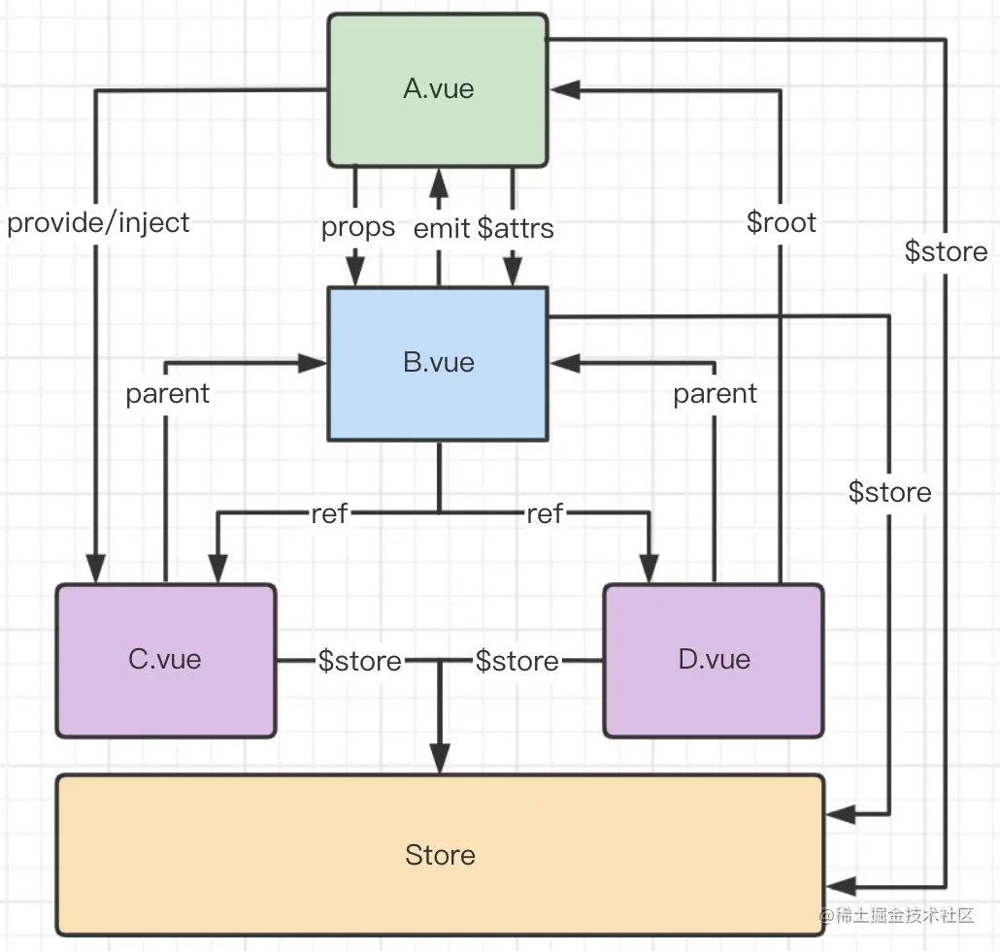

> 

# Vue 生命周期

## 一、简介

### 基本概念
Vue 组件间通信主要指父子组件通信、隔代组件通信、兄弟组件通信这三类通信。

### 组件通信图示

## 二、组件通信常用方式
	
1、 `props/$emit` 适用父子组件通信

2、 `Eventbus`（$emit/~~$on~~） 适用于 父子、隔代、兄弟组件通信
* 通过一个空的 Vue 实例作为事件中），用它来触发事件和监听事件，从而实现任何组件间的通信，包括父子、隔代、兄弟组件。

3、 `$parent`/~~$children~~ 适用父子组件通信
* `$parent / $children`：访问父 / 子实例

4、 `$attrs`/~~$listeners~~  适用于 隔代组件通信

5、 `ref` 适用父子组件通信 
* `ref`：如果在普通的 DOM 元素上使用，引用指向的就是 DOM 元素；如果用在子组件上，引用就指向组件实例

6、 $root 

7、 vuex 用于 父子、隔代、兄弟组件通信
* `Vuex` 的状态存储是响应式的。当 Vue 组件从 `store` 中读取状态的时候，若 store 中的状态发生变化，那么相应的组件也会相应地得到高效更新。
* 改变 `store` 中的状态的唯一途径就是显式地提交  (commit) `mutation`。这样使得我们可以方便地跟踪每一个状态的变化。

8、 provide / inject 适用于 隔代组件通信
祖先组件中通过 `provider` 来提供变量，然后在子孙组件中通过 `inject` 来注入变量。 `provide / inject` API 主要解决了跨级组件间的通信问题，不过它的使用场景，主要是子组件获取上级组件的状态，跨级组件间建立了一种主动提供与依赖注入的关系。

## 三、归类

根据组件之间关系讨论组件通信

* 父子组件：props/$emit/$parent/ref/$attrs

* 兄弟组件：$parent/$root/eventbus/vuex

* 跨层级关：系eventbus/vuex/provide+inject

## 五、总结

* 1、父子组件通信可以使用 props/$emit，也可以使用 $parent 获取父组件实例、ref获取组件实例

* 2、兄弟组件通信可以使用 Eventbus，通过一个空的 Vue 实例作为事件中心，用它来触发事件和监听事件，也可以使用 $parent 、vueX

* 3、跨层级通信可以使用 Eventbus，也可以使用 vuex/provide+inject

* 注意vue3中废弃的几个API

[~~$children~~](https://link.juejin.cn/?target=https%3A%2F%2Fv3-migration.vuejs.org%2Fbreaking-changes%2Fchildren.html)

[~~$listeners~~](https://link.juejin.cn/?target=https%3A%2F%2Fv3-migration.vuejs.org%2Fbreaking-changes%2Flisteners-removed.html)

[~~$on~~](https://link.juejin.cn/?target=https%3A%2F%2Fv3-migration.vuejs.org%2Fbreaking-changes%2Fevents-api.html%23overview
)
